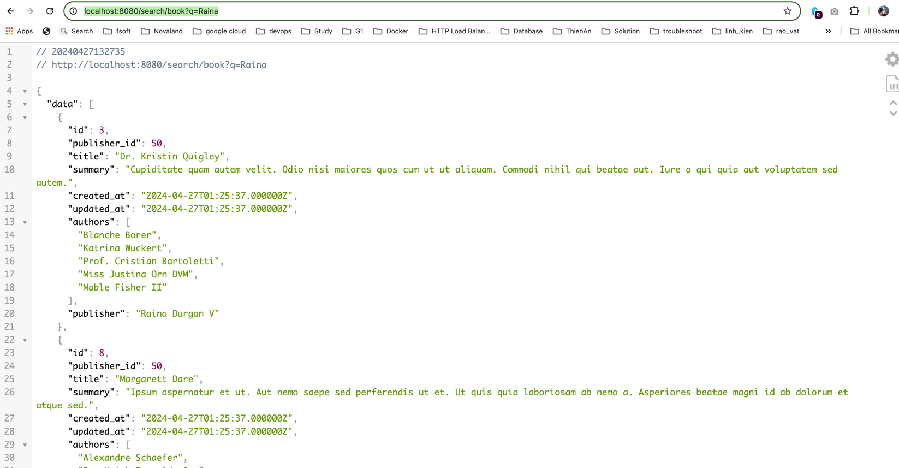

# Require
- Docker
- Docker Compose
- Device use chip Intel or AMD not ARM

## Run source code
- docker-compose up -d
- docker exec -it db-mysql bash
- mysql -u root -p < /opt/database/db_exam.sql (password: admin)
- click: ctrl + p + q
- docker exec -it web composer install
- docker restart jobs
- docker exec -it web php artisan scout:import

## Run index
docker exec -it web php artisan scout:import
## Run unit test
docker exec -it web php artisan test

## Brower to view result:
http://localhost:8080/search/book?q=Raina

